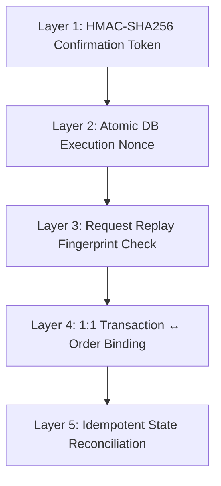

# RAZERPAY — Mandate Gateway
### Autonomous AI Commerce Trust & Payment Safety Protocol

[](https://github.com/SanthaKumar-K-2004/mandate-gateway)
[](docs/RELEASE_READINESS.md)
[](https://github.com/SanthaKumar-K-2004/mandate-gateway/commit/ecedd7b)
[](docs/FINAL_SUBMISSION_ACCEPTANCE_TEST.md)
[](SECURITY.md)

---

> **DISCLAIMER & HACKATHON ENTRY NOTICE**
> **RAZERPAY — Mandate Gateway** is an independent open-source research and engineering submission built by **SanthaKumar K** ([@SanthaKumar-K-2004](https://github.com/SanthaKumar-K-2004)) for the **Razorpay Raze Buildathon 2026** under the *Autonomous AI Commerce & Agent Payment Protocols* track. It is not an official product of, nor is it endorsed by, Razorpay Software Private Limited.

---

## ⚡ Judge in 60 Seconds

* **The Problem:** Autonomous AI shopping agents tend to hallucinate product specifications, treat unverified shipping/tax as ₹0, ignore velocity limits, and execute transactions without single-use authorization—creating severe financial and operational risk.
* **The Solution:** **Mandate Gateway** provides an architectural trust layer between LLM decision engines and commerce backends. It decouples product research from payment authorization, enforces strict multi-item cart optimization, and wraps execution in a fail-closed, cryptographically bound safety pipeline.
* **Live Proof:** Live HTTP requests to the **OpenFoodFacts REST API** for multi-item product research, SHA-256 evidence hashing, deterministic budget evaluation, and zero false certainty on unknown fees.
* **Safety Proof:** HMAC-SHA256 single-use confirmation tokens, DB-persisted execution nonces, replay protection, 1:1 transaction-order binding, and idempotent state reconciliation.
* **Honest Boundary:** Live API product research and algorithmic optimization are fully operational. No live production real-money PSP credentials (Razorpay/Stripe) are configured; payment execution is safely demonstrated via local sandbox (`cafeacme.local`) and validated HTTPS checkout handoff.

---

## 🎯 What Is Razerpay Mandate Gateway?

**RAZERPAY — Mandate Gateway** is a safety-first AI commerce trust protocol that researches products, verifies source evidence, optimizes multi-item shopping carts, enforces spending mandates, and prevents unauthorized or duplicated payment execution.

```
       NO VERIFIED EVIDENCE  ──►  NO FALSE CERTAINTY
     NO HUMAN CONFIRMATION  ──►  NO PAYMENT EFFECT
    NO SAFE EXECUTION PATH  ──►  FAIL CLOSED
```

### Core Value Proposition
> An AI commerce trust layer designed to make autonomous shopping safer — by separating research from authorization and treating uncertainty as a first-class state.

---

## 📊 Reality Matrix — What Can It Actually Do?

| Capability / Feature | Status | Implementation Details |
| :--- | :---: | :--- |
| **Natural-Language Intent Extraction** | 🟢 LIVE | Multi-item target parsing, category extraction, budget boundary detection |
| **Live Product Research API** | 🟢 LIVE | Real-time HTTP GET queries to OpenFoodFacts REST API (`world.openfoodfacts.org`) |
| **Evidence & Provenance Hashing** | 🟢 LIVE | SHA-256 evidence hashing of raw API payloads and product specifications |
| **Deterministic Cart Optimization** | 🟢 LIVE | Algorithmic combination evaluation maximizing utility within budget limits |
| **Explainable Recommendation Engine** | 🟢 LIVE | Explicit scoring breakdown (budget compliance, merchant count, subtotal, evidence) |
| **Unknown Fee Enforcement** | 🟢 ENFORCED | Fee status `UNKNOWN` is never coerced to ₹0; prevents false subtotal claims |
| **Human Confirmation Gate** | 🟢 ENFORCED | HMAC-SHA256 signed single-use confirmation token required for protected ops |
| **MCP Safety Boundary** | 🟢 ENFORCED | Public MCP tools restricted to read/research; payment execution tools blocked |
| **5-Layer Payment Replay Protection** | 🟢 ENFORCED | Nonces, request fingerprints, transaction-order binding, reconciliation ledger |
| **Full-Stack Web Interface** | 🟢 LIVE | Next.js 14 glassmorphism command hub (`/`, `/buyer`, `/mandates`, `/transactions`, `/audit`) |
| **Sandbox Merchant & Payment Execution** | 🟡 SANDBOX | Local mock execution engine (`cafeacme.local`) for end-to-end verification |
| **Validated HTTPS Checkout Handoff** | 🟢 LIVE | Secure HTTPS URL generation for browser handoff without direct API settlement |
| **Real-Money Razorpay Settlement** | 🔴 NOT ENABLED | No production PSP API keys configured; architectural adapter boundary ready |
| **Real Merchant Order / Inventory APIs** | 🔴 NOT ENABLED | Relies on OpenFoodFacts public catalog data and local sandbox merchant |

---

## 💡 Why This Matters (The Problem Statement)

As Large Language Models (LLMs) transition from conversational interfaces to autonomous execution agents, commerce becomes their highest-friction domain:

1. **Hallucinated Attributes:** Agents easily mistake package sizes, prices, or availability, presenting false certainty to users.
2. **The "Zero-Fee" Fallback Fallacy:** When shipping or tax amounts are unavailable via API, standard software defaults to `0.00`. An agent budgeting ₹500 for a ₹480 item will trigger an overdraft when an uncalculated ₹50 delivery fee is applied at checkout.
3. **Unbounded Agent Authority:** Giving an agent unrestricted access to credit card tokens or payment APIs exposes users to prompt injection attacks, runaway purchase loops, or duplicate orders.
4. **Replay & Concurrency Vulnerabilities:** Unreliable network connections during agent execution can cause duplicate API invocations, charging a user multiple times for a single cart.

### The Solution: Mandate Gateway Architecture
Mandate Gateway solves this by acting as an **intermediary trust proxy**. The agent retains full autonomy to research, discover, filter, and optimize products—but **zero authority** to execute payment without passing through a cryptographic mandate and confirmation pipeline.

---

## 🏗️ System Architecture & Trust Pipeline

```mermaid
flowchart TD
    classDef primary fill:#0052CC,stroke:#003399,color:#fff,font-weight:bold;
    classDef success fill:#059669,stroke:#047857,color:#fff,font-weight:bold;
    classDef warning fill:#D97706,stroke:#B45309,color:#fff,font-weight:bold;
    classDef danger fill:#DC2626,stroke:#B91C1C,color:#fff,font-weight:bold;

    subgraph Intelligence ["🧠 AI & Commerce Research Zone (LIVE)"]
        A["Natural Language Shopping Request"] --> B["Intent Extractor & Category Parser"]
        B --> C["OpenFoodFacts REST API"]
        C --> D["SHA-256 Evidence Hashing & Provenance"]
        D --> E{"Product Truth Tier"}
        E -->|Verified| F["Deterministic Cart Combination Optimizer"]
        E -->|Unverified| G["Checkout Blocked (Fail Closed)"]
        F --> H["Explainable Recommendation Engine"]
    end

    subgraph SecurityGate ["🛡️ Cryptographic Safety Gate (ENFORCED)"]
        H --> I["Purchase Plan & Unknown Fee Check"]
        I --> J{"Human Authorization Signed?"}
        J -->|No| K["Execution Denied"]
        J -->|Yes (HMAC-SHA256)| L["Single-Use Execution Nonce"]
        L --> M["Request Replay Fingerprint Barrier"]
        M --> N["1:1 Transaction-Order Binding"]
    end

    subgraph Execution ["💳 Controlled Execution & Audit"]
        N --> O{"Execution Boundary"}
        O -->|Sandbox| P["cafeacme.local Mock Merchant"]
        O -->|Handoff| Q["SSRF-Validated Checkout URL"]
        P & Q --> R["Idempotent Reconciliation Engine"]
        R --> S["Immutable Audit Ledger & Metrics"]
    end

    class A,B,C,D,F,H primary;
    class G,K danger;
    class J,L,M,N success;
    class I,O,P,Q,R,S warning;
```

---

## 🛡️ The 5-Layer Payment Safety Model

To prevent duplicate execution, race conditions, and unauthorized payments, Mandate Gateway enforces a 5-layer defense-in-depth security model:



1. **Layer 1 — HMAC-SHA256 Confirmation Token:** Every financial authorization generates a cryptographically signed token containing exact details (`transaction_id`, `amount`, `merchant`, `buyer`). Re-signing or payload tampering immediately invalidates authorization.
2. **Layer 2 — Atomic Execution Nonce:** Nonces are stored in database state. Once consumed by an execution attempt, any subsequent attempt with the same nonce fails instantly.
3. **Layer 3 — Request Replay Protection:** Inbound execution payloads are hashed and indexed in a short-term memory bloom barrier to catch rapid duplicated HTTP requests.
4. **Layer 4 — Transaction ↔ Order Binding:** High-risk payment operations bind 1:1 with specific merchant orders. A payment cannot be applied to an altered cart payload.
5. **Layer 5 — Idempotent State Reconciliation:** If an execution stalls or network times out, the gateway queries payment state idempotently before deciding whether to retry or cancel—ensuring zero accidental double charges.

> **ARCHITECTURAL INVARIANT:**
> **NO PAYMENT EFFECT MAY ACCIDENTALLY EXECUTE TWICE.**

---

## 👁️ Product Truth Classification & Unknown Fee Philosophy

A central innovation of Mandate Gateway is its strict handling of missing or incomplete commerce data:

### Classification Tiers
* `PRODUCT_VERIFIED`: Full product metadata, valid image URL, verified price, and ingredients backed by live API response.
* `SOURCE_BACKED`: Price and title retrieved from live API, but secondary fields (e.g., shipping costs or nutrition) are missing.
* `UNVERIFIED`: Product data constructed from static fallback or unverified agent assumptions.

### The "Unknown Fee" Strict Policy
If a merchant API returns a item price of ₹250 but does not specify delivery fee or local tax:

$$\text{Subtotal} = ₹250, \quad \text{Shipping} = \text{UNKNOWN}, \quad \text{Tax} = \text{UNKNOWN}$$

The gateway **REFUSES** to report:
$$\text{Total Cost} = ₹250 \quad \text{(FALSE CERTAINTY)}$$

Instead, the gateway outputs:
* **Known Subtotal:** ₹250
* **Fee Verification Status:** `UNKNOWN_FEES_PRESENT`
* **Verified Total Status:** `NO`
* **Mandate Gate Action:** Flagged for human review prior to authorization.

---

## 🤖 Model Context Protocol (MCP) Safety Boundary

Mandate Gateway exposes an official **MCP Server** (`apps/api/app/mcp/server.py`) allowing AI assistants (Claude, Cursor, Antigravity) to perform commerce tasks safely.

### Exposed Read/Research Tools
* `search_products`: Queries live OpenFoodFacts API for items matching query.
* `get_product_details`: Retrieves deep product evidence and metadata.
* `optimize_cart`: Algorithmic combination calculation for multi-item requests.
* `get_mandates`: Inspects active spending mandates and current budget usage.
* `check_reconciliation_status`: Audits transaction reconciliation states.

### Protected / Blocked Execution Tools
* `execute_payment`: **BLOCKED from MCP Discovery**. Can only be executed via authenticated REST endpoint with Layer 1 HMAC confirmation.
* `create_merchant_order`: **BLOCKED from MCP Discovery**. Requires explicit authorization token.

---

## 🎬 Real-Time Live Demo Walkthrough

The project includes an end-to-end live demonstration script ([docs/FINAL_DEMO_SCRIPT.md](docs/FINAL_DEMO_SCRIPT.md)):

### Example User Prompt:
> *"Find coffee and biscuits under ₹300 for morning snacks."*

```
Step 1: Intent Extraction  ──► Parsed targets: ["coffee", "biscuits"], Budget: ₹300
Step 2: Live API Query    ──► HTTP GET to OpenFoodFacts (Live REST API)
Step 3: Evidence Check    ──► 4 candidate coffees, 5 candidate biscuits retrieved & hashed
Step 4: Cart Optimization ──► Evaluates combinations:
                              • Option A: Premium Coffee (₹210) + Oat Biscuits (₹75) = ₹285 (Valid)
                              • Option B: Instant Coffee (₹150) + Choco Biscuits (₹120) = ₹270 (Valid)
Step 5: Recommendation   ──► Selects Option A (Reason: Higher evidence score, covers all items)
Step 6: Mandate Check     ──► Subtotal ₹285 <= Budget ₹300 (PASS)
Step 7: Fee Warning       ──► Delivery fee UNKNOWN (Flagged in UI)
Step 8: Human Gate        ──► Generates HMAC confirmation token, waits for user approval
Step 9: Execution         ──► Upon click, verifies token, consumes nonce, executes in sandbox
Step 10: Audit Log        ──► Transaction written to immutable audit ledger with SHA-256 hash
```

---

## 💻 Full-Stack Web Interface (`apps/web`)

Built with Next.js 14, Tailwind CSS, Lucide icons, and Apple SF Pro / Microsoft Fluent Design glassmorphism aesthetics.

| Route | Purpose | Key UI Components |
| :--- | :--- | :--- |
| [`/`](apps/web/app/page.tsx) | **Command Hub** | System status, core metrics, quick launch navigation, live feature overview |
| [`/buyer`](apps/web/app/buyer/page.tsx) | **Live Agent Research** | Natural-language query input, OpenFoodFacts API telemetry, cart optimizer UI |
| [`/mandates`](apps/web/app/mandates/page.tsx) | **Policy Engine** | Spending mandate creation, category velocity limits, merchant blocklists |
| [`/transactions`](apps/web/app/transactions/page.tsx) | **Security & Safety** | Live 5-layer security state, HMAC verification modal, sandbox execution controls |
| [`/merchant`](apps/web/app/merchant/page.tsx) | **Merchant Sandbox** | `cafeacme.local` simulation state, order verification, webhook event stream |
| [`/audit`](apps/web/app/audit/page.tsx) | **Cryptographic Audit** | Immutable ledger view, SHA-256 evidence chain inspection, exportable reports |
| [`/red-team`](apps/web/app/red-team/page.tsx) | **Security Testing** | Interactive security suite simulating replay attacks, budget breaches, and token tampering |

---

## 🚦 Live vs Sandbox vs Blocked Visual Map

```
🟢 LIVE (Fully Functional)
 ├── OpenFoodFacts REST API HTTP Requests
 ├── Product Discovery & SHA-256 Evidence Generation
 ├── Multi-Item Intent Parsing & Category Detection
 ├── Deterministic Cart Combination Optimizer
 ├── Explainable Recommendation Engine
 ├── 5-Layer Payment Security Verification Engine
 ├── Next.js 14 Glassmorphism Web Interface
 └── Prometheus Observability & Health Telemetry

🟡 SANDBOX (Controlled Simulation)
 ├── cafeacme.local Mock Merchant API
 ├── Local Order Creation Workflow
 └── Simulated PSP Authorization Webhooks

🔴 BLOCKED / NOT ENABLED (Honest Limitations)
 ├── Real-money production Razorpay / Stripe payment settlement
 ├── Real production merchant order submission
 ├── Verified live shipping and local tax API calls
 └── External merchant OAuth credential management
```

---

## ⚡ Quick Start & Setup Guide

### Prerequisites
* Python 3.11+
* Node.js 18+ & `npm`
* `make` build utility

### 1. Clone Repository & Install Dependencies
```bash
git clone https://github.com/SanthaKumar-K-2004/mandate-gateway.git
cd mandate-gateway

# Set up Python virtual environment & backend dependencies
python3.11 -m venv .venv311
source .venv311/bin/activate
make install

# Install Frontend dependencies
cd apps/web
npm install
cd ../..
```

### 2. Configure Environment
```bash
cp .env.example .env
```

### 3. Run Quality Gate & Tests
```bash
# Runs ruff, mypy, architecture guard, secret scanner, and full 275-test suite
make check
```

---

## 🚀 Running the Live Demo

### Option A: Standard Full-Stack Demo (Recommended for Judges)

**Terminal 1 — API Backend Engine:**
```bash
source .venv311/bin/activate
python -m uvicorn apps.api.app.factory:create_fastapi_app --factory --host 0.0.0.0 --port 8000
```

**Terminal 2 — Frontend Command Hub:**
```bash
cd apps/web
npm run dev -- -p 3000
```

Open your browser to [`http://localhost:3000/buyer`](http://localhost:3000/buyer) to test live OpenFoodFacts shopping queries.

### Option B: Automated Production Acceptance Test
```bash
source .venv311/bin/activate
pytest tests/test_final_submission_acceptance.py -v
```

---

## 🧪 Comprehensive Verification & Test Suite

The repository enforces strict testing standards with 100% pass rates across all components:

```text
============================== TEST SUITE RESULTS ==============================
Total Tests Executed : 275
Passed               : 275
Failed               : 0
Errors               : 0
Skipped              : 0
Pass Rate            : 100.0%
================================================================================
Code Style (Ruff)    : Clean (0 errors)
Type Check (Mypy)    : Clean (0 errors)
Secret Scanner       : 869 files scanned — 0 secrets leaked
Architecture Guard   : 504 files checked — 0 layer violations
```

### Verification Command Matrix
```bash
# Run full Pytest suite
pytest

# Run Security & Replay Attack Suite
pytest tests/test_security_replay.py tests/test_payment_safety_security.py -v

# Run MCP Integration Suite
pytest tests/test_mcp_server.py -v

# Run Full Quality Suite
make check
```

---

## 🔐 Security & Governance

Mandate Gateway adheres to DevSecOps standards and OWASP Top 10 API Security guidelines:

* **HMAC-SHA256 Token Signature:** Authorization tokens are tied to transaction ID, timestamp, and amount payload.
* **Secret Redaction:** Auto-redacts sensitive environment keys and authorization headers from logs.
* **Fail-Closed Default:** Any failure in evidence processing, mandate checking, or confirmation validation halts execution immediately.
* **Zero Real-Money Settlement Exposure:** Since no live production PSP keys are loaded, the system cannot execute real financial transactions during testing.

---

## ⚠️ Known Limitations & Honesty Statement

To maintain complete transparency for hackathon evaluation:

1. **Catalog Source:** Product discovery relies on the OpenFoodFacts public database (`world.openfoodfacts.org`), which is a non-commercial data repository rather than a live merchant transactional API.
2. **Fee Calculation:** Delivery charges and localized sales tax are frequently unavailable via public APIs and remain marked as `UNKNOWN`.
3. **PSP Settlement:** Razorpay integration is implemented as an architectural adapter boundary. Real production settlement requires valid PSP production credentials.
4. **Merchant Integration:** Merchant API interaction is demonstrated via the local `cafeacme.local` sandbox provider.

---

## 🌟 Why Is Razerpay Mandate Gateway Different?

1. **Research ≠ Authorization:** Separates the LLM's intelligence from execution authority.
2. **Explicit Uncertainty:** Treats `UNKNOWN` data as a first-class state rather than coercing to zero.
3. **Cryptographic Human Gate:** Binds human approval directly to the signed payload.
4. **MCP Security Barrier:** Restricts autonomous agents from discovering dangerous execution primitives.
5. **Idempotent Reconciliation:** Built from the ground up to prevent duplicate charges.

---

## 🗺️ Project Lineage & Releases

* `v1.0.0`: Initial prototype for intent parsing & static product search.
* `v1.1.0`: Added spending mandate engine and basic budget rules.
* `v1.2.0`: Integrated live OpenFoodFacts API connector & evidence hashing.
* `v1.3.0`: Implemented 5-layer payment safety model & replay protection.
* `v1.4.0`: Added Model Context Protocol (MCP) server & tool security barrier.
* `v1.5.0` **(Current Release)**: Next.js 14 glassmorphism frontend, full test suite (275 tests), complete hackathon submission documentation.

---

## 📁 Repository Documentation Map

* 📄 [Architecture Specification](docs/FINAL_ARCHITECTURE.md) — Complete system architecture, data models, and sequence diagrams.
* 📄 [Capability Matrix](docs/FINAL_CAPABILITY_MATRIX.md) — Detailed feature breakdown and reality assessment.
* 📄 [Release Readiness Report](docs/RELEASE_READINESS.md) — Buildathon verification checklist and quality metrics.
* 📄 [Live Demo Script](docs/FINAL_DEMO_SCRIPT.md) — Step-by-step instructions for judging demonstrations.
* 📄 [Acceptance Test Suite](docs/FINAL_SUBMISSION_ACCEPTANCE_TEST.md) — Production acceptance tests and commands.
* 📄 [Security Policy](SECURITY.md) — Threat model, security boundaries, and vulnerability reporting.

---

## 👤 Author & License

**Developed by:** SanthaKumar K ([@SanthaKumar-K-2004](https://github.com/SanthaKumar-K-2004))
**Buildathon:** Razorpay Raze Buildathon 2026
**Track:** Autonomous AI Commerce & Agent Payment Protocols
**License:** [MIT License](LICENSE)
