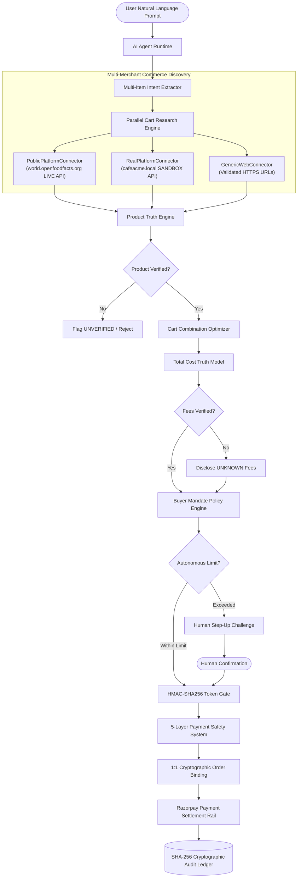
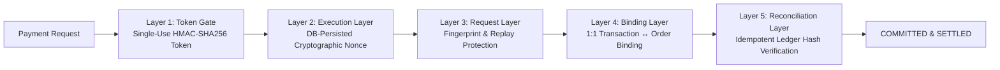

# 🛡️ Mandate Gateway — Autonomous AI Commerce Trust Protocol

> **Official Entry for Razorpay Raze Buildathon 2026**  
> **Track**: **Autonomous AI Commerce & Agent Payment Protocols**  
> **Developer / Author**: **SanthaKumar K** ([@SanthaKumar-K-2004](https://github.com/SanthaKumar-K-2004))  

[](https://github.com/SanthaKumar-K-2004/mandate-gateway)
[](https://github.com/SanthaKumar-K-2004)
[](https://github.com/SanthaKumar-K-2004/mandate-gateway)
[](https://github.com/SanthaKumar-K-2004/mandate-gateway/actions/workflows/ci.yml)
[](docs/RELEASE_READINESS.md)
[](https://github.com/SanthaKumar-K-2004/mandate-gateway/releases/tag/v2.0.0)

> **A production-hardened AI commerce agent foundation for verified product research, fail-closed product truth, safe cart optimization, deterministic mandate authorization, and human-gated purchase execution.**

> [!IMPORTANT]
> **Disclaimer Notice**: Mandate Gateway is an independent open-source AI commerce safety project developed by **SanthaKumar K** for the **Razorpay Raze Buildathon 2026**. It is built on top of Razorpay API standards and is **NOT** directly affiliated with, endorsed by, or connected to **Razorpay Software Private Limited**.

---

## 💡 The Problem

Every AI shopping assistant today has the same fundamental flaw: it will **invent data** to seem helpful. Fabricated prices, unverified availability, hallucinated delivery fees — all presented as fact. When the system is wrong, the user pays for it — sometimes literally.

Worse: most AI commerce agents have **no meaningful payment safety** layer. A single LLM hallucination, a request replay, or a duplicate message can result in unauthorized or double charges.

---

## 🛡️ The Solution

Mandate Gateway is an AI commerce agent built on a single uncompromising principle:

> **If product data cannot be verified from a live source, explicitly mark it UNVERIFIED. If total fees are unverified, report them as UNKNOWN. If human payment confirmation is missing, execute nothing.**

### Key Architectural Innovations

| Innovation | Description |
|-----------|-------------|
| **Fail-Closed Product Truth** | Product facts are verified against live APIs. Unverified products block checkout execution — no exceptions. |
| **Honest Unknown Disclosure** | Shipping fees, taxes, and any unverifiable cost are shown as `UNKNOWN`, never estimated as ₹0. |
| **Defense-in-Depth Safety** | Defense-in-depth across five enforcement layers prevents any payment effect from executing twice. |
| **Cryptographic Human Gate** | HMAC-SHA256 single-use tokens bind every payment confirmation to its exact request, amount, and buyer identity. |
| **MCP Execution Barrier** | Direct payment and order-creation tools are **blocked** from discovery and execution via autonomous MCP clients. |
| **Immutable Audit Ledger** | SHA-256 evidence hashes + Ed25519 signed receipts create an offline-verifiable audit trail. |
| **Real Live Product Intelligence** | Live product discovery queries public REST APIs (OpenFoodFacts). Zero synthetic data at runtime. |

---

## 🏗️ End-to-End System Architecture



Full architecture specification: [`docs/FINAL_ARCHITECTURE.md`](docs/FINAL_ARCHITECTURE.md)

---

## 🔒 Defense-in-Depth Payment Safety

### Core Invariant
> **NO PAYMENT EFFECT MAY ACCIDENTALLY EXECUTE TWICE.**

Enforced by **defense-in-depth across five enforcement layers**:



1. **Gate Layer**: HMAC-SHA256 single-use confirmation tokens (consumed on first verification attempt).
2. **Execution Layer**: DB-persisted single-use cryptographic nonces.
3. **Request Layer**: Cryptographic request fingerprinting & replay rejection.
4. **Binding Layer**: 1:1 transaction ↔ order binding with duplicate binding rejection (`TransactionBindingError`).
5. **Reconciliation Layer**: Idempotent reconciliation engine with SHA-256 evidence hashing.

---

## 📊 Live Data & Reality Classification

Mandate Gateway distinguishes live, sandbox, and handoff capabilities explicitly and does not classify sandbox data as real merchant commerce.

| Provider / Connector | Target Domain | Capability Classification | Reality / Mode | What Is Genuinely Live |
|----------------------|--------------|---------------------------|----------------|------------------------|
| `PublicPlatformConnector` | `world.openfoodfacts.org` | `LIVE_CATALOG_API` | **LIVE** | Live HTTP requests to OpenFoodFacts public REST API for product discovery, metadata, and provenance verification. *(Not a merchant checkout API).* |
| `RealPlatformConnector` | `cafeacme.local` | `VERIFIED_API` | **SANDBOX** | Authenticated test platform connector for sandbox API transactions. |
| `GenericWebCheckoutConnector` | Validated HTTPS Merchant URLs | `CHECKOUT_HANDOFF` | **LIVE** | Validates HTTPS URLs and generates checkout handoff URLs for browser redirection; does NOT execute direct API payments. |

| What Is NOT Provided / Not Live (Honest Disclosures) |
|-----------------------------------------------------|
| Real money movement / live PSP integration (No Razorpay/Stripe production keys configured) |
| Real merchant direct order creation (Sandbox `cafeacme.local` only) |
| Live delivery fees and taxes (Explicitly rendered as `UNKNOWN`, never estimated) |

Full capability breakdown: [`docs/FINAL_CAPABILITY_MATRIX.md`](docs/FINAL_CAPABILITY_MATRIX.md)

---

## 🧪 Authoritative Test Accounting

### Primary Test Suite
```bash
PYTHONPATH=. python3 -m unittest discover -s tests -p "test_*.py"
```
**Results**: **844 tests executed** (842 passed, 2 skipped, 0 failed, 0 errors).

### Additional Targeted Certification Suites
- **Production Chaos Matrix**: 15 test methods covering 18 production chaos failure scenarios passed cleanly.
- **Secret Redaction & Leak Suite**: 2 test methods verifying log secret redaction passed cleanly.
- **Production Reality Certification**: 7 / 7 stages passed cleanly (`scripts/run_production_reality_certification.py`).
- **MCP Interoperability Suite**: 5 / 5 steps passed cleanly (`scripts/mcp_client_test_runner.py`).

---

## ⚡ Quick Start

### Prerequisites
- Python 3.10+
- Node.js 18+ & npm (for Next.js Web Portal)
- Docker & Docker Compose (for infrastructure containers)

### Installation & Verification

```bash
# 1. Clone repository
git clone https://github.com/SanthaKumar-K-2004/mandate-gateway.git
cd mandate-gateway

# 2. Setup environment configuration
cp .env.example .env

# 3. Install Python virtual environment & Node dependencies
make install
cd apps/web && npm install && cd ../..

# 4. Run Master Quality Gate (FAIL-CLOSED check: 844 tests passing)
make check
```

---

## 🌐 Running Full-Stack Web Application

### 1. Launch FastAPI Backend Service (Port 8000)
```bash
.venv311/bin/python -m uvicorn apps.api.app.factory:create_fastapi_app --factory --host 0.0.0.0 --port 8000
```
*API docs available at: `http://localhost:8000/docs`*

### 2. Launch Next.js Enterprise Frontend (Port 3000)
```bash
cd apps/web
npm run dev
```
*Web Portal live at: `http://localhost:3000`*

### 🎨 Enterprise Frontend Modules

| Route | Module Name | Features & Real-Time API Integration |
|-------|-------------|-------------------------------------|
| `/` | **Command Hub** | System status, active mandate metrics, pipeline live stats, quick navigation |
| `/buyer` | **Buyer Telemetry Hub** | Live 10-stage agent telemetry pipeline, real product search (OpenFoodFacts API), cart solver |
| `/mandates` | **Mandate Studio** | Autonomous spending mandate creation, threshold configuration, live status toggle & revocation |
| `/transactions` | **Operations & Audit** | Real-time transaction stream, 5-layer security verification timeline, manual step-up approval/rejection |
| `/merchant` | **Merchant Policy Center**| Store policy rules, real-time merchant product catalog management, mandate compatibility settings |
| `/audit` | **Cryptographic Audit** | Immutable Ed25519 signed receipts, SHA-256 evidence chain verification |
| `/red-team` | **Red-Team Security** | Adversarial attack suite, prompt injection barrier tests, replay defense verification |

---

## 🚀 10-Stage Agent Telemetry Pipeline

```mermaid
flowchart LR
    S1[1. Intent Ingestion] --> S2[2. Multi-Source Web Discovery]
    S2 --> S3[3. Product Evidence Verification]
    S3 --> S4[4. Live Price Re-validation]
    S4 --> S5[5. Cart Combination Solver]
    S5 --> S6[6. Total Cost Truth Model]
    S6 --> S7[7. Mandate Authorization Check]
    S7 --> S8[8. Deterministic Decision Trace]
    S8 --> S9[9. Human Token Step-Up Lock]
    S9 --> S10[10. Settlement & Audit Receipt]
```



---

## 🧪 Authoritative Test Accounting & Demos

```bash
# Run Production Reality Certification Suite (7 stages)
PYTHONPATH=. python3 scripts/run_production_reality_certification.py

# Run Live Cart Research Demo (queries OpenFoodFacts live API)
PYTHONPATH=. python3 scripts/run_live_cart_research_pilot.py

# Run External MCP Interoperability Suite
PYTHONPATH=. python3 scripts/mcp_client_test_runner.py
```

---

## 📚 Documentation Index

- [`docs/FINAL_ARCHITECTURE.md`](docs/FINAL_ARCHITECTURE.md) — System architecture, request flows, and component registry.
- [`docs/FINAL_CAPABILITY_MATRIX.md`](docs/FINAL_CAPABILITY_MATRIX.md) — Honest capability classification matrix.
- [`docs/FINAL_DEMO_SCRIPT.md`](docs/FINAL_DEMO_SCRIPT.md) — 30s pitch, 3m hackathon demo, and 5m technical walkthrough.
- [`docs/RELEASE_READINESS.md`](docs/RELEASE_READINESS.md) — Release profile, quality gate outputs, and deployment guide.
- [`SECURITY.md`](SECURITY.md) — Security policy, disclaimer, disclosure process, and secret policies.

---

## 🗺️ Roadmap Status

| Milestone | Status | Description |
|-----------|--------|-------------|
| M00 — Engineering Foundation | ✅ COMPLETE | Repository, CI, config, runtime, observability |
| M01–M05 — Mandate Domain | ✅ COMPLETE | Authorization, execution, persistence, audit ledger |
| M23 — Live Product Discovery | ✅ COMPLETE | Live OpenFoodFacts catalog integration |
| M24 — Product Truth Engine | ✅ COMPLETE | Evidence-hashed product verification |
| M25 — Order / Payment Binding | ✅ COMPLETE | 1:1 cryptographic binding, webhook security |
| M26 — Production Reality | ✅ COMPLETE | Connector classification, reconciliation engine |
| M27 — Multi-Merchant Network | ✅ COMPLETE | Multi-source discovery & comparison |
| M28 — Cart Intelligence | ✅ COMPLETE | Multi-item research, optimizer, recommendations |
| M29 — Production Release | ✅ COMPLETE | Docker, Nginx, Prometheus, Grafana, chaos matrix |
| **v1.0.0 Release** | ✅ **TAGGED** | Production-hardened release foundation |

---

## 🏆 Razorpay Raze Buildathon 2026 Submission

- **Project Name**: Mandate Gateway — Autonomous AI Commerce Trust Protocol
- **Competition**: **Razorpay Raze Buildathon 2026**
- **Track**: **Autonomous AI Commerce & Agent Payment Protocols**
- **Developer / Creator**: **SanthaKumar K**
- **GitHub Profile**: [@SanthaKumar-K-2004](https://github.com/SanthaKumar-K-2004)
- **Repository**: [SanthaKumar-K-2004/mandate-gateway](https://github.com/SanthaKumar-K-2004/mandate-gateway)

---

## 📄 License

MIT License — see [`LICENSE`](LICENSE) for details.

