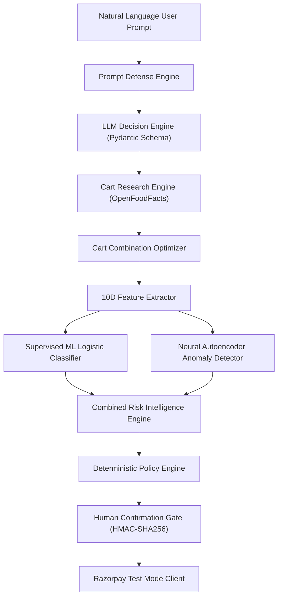

# RAZORPAY — AI Architecture Specification

## Overview

The **Razorpay AI Commerce Intelligence Layer** incorporates a dual-phase AI architecture combining LLM-powered natural language shopping intent reasoning with multi-model quantitative risk evaluation (Supervised ML Logistic Regression + Unsupervised Neural Autoencoder Anomaly Detection).

> [!IMPORTANT]
> **Safety Invariant**: LLM reasoning and ML/Neural Risk models are **advisory and intelligence inputs ONLY**. They possess ZERO direct financial authority and CANNOT initiate, authorize, or execute payments without deterministic Policy Engine validation and HMAC-SHA256 single-use human authorization.

---

## 1. Intelligence Architecture Overview



---

## 2. LLM Intent Reasoning Engine & Structured Output

### Schema Contracts (`AICommerceDecision`)

All LLM providers (`OpenAIProvider`, `LocalLLMProvider`, `MockLLMProvider`) produce typed Pydantic instances of `AICommerceDecision`:

```python
class ShoppingItemIntent(BaseModel):
    item_name: str
    target_category: Optional[str] = None
    quantity: int = Field(default=1, ge=1)
    max_unit_price_paise: Optional[int] = None
    preferred_brands: List[str] = Field(default_factory=list)

class AICommerceDecision(BaseModel):
    intent_summary: str
    items: List[ShoppingItemIntent]
    total_budget_paise: int
    currency: str = "INR"
    user_preferences: List[str]
    research_strategy: str
    reasoning: str
    prompt_injection_detected: bool = False
    confidence_score: float
    requires_human_confirmation: bool = True
    allowed_action: str = "RESEARCH_ONLY"
```

---

## 3. Prompt Defense Engine (`PromptDefenseEngine`)

Untrusted inputs are sanitized against injection attacks:
- System prompt override detection (`"ignore previous instructions"`, `"system override"`).
- Financial authority bypass detection (`"grant unlimited budget"`, `"bypass authorization"`).
- Invisible unicode stripping (zero-width spaces `\u200B`, `\u200C`, `\u200D`).
- Regex pattern matching against known DAN/jailbreak templates.

---

## 4. Multi-Model Risk Intelligence Engine

1. **Feature Extractor (`FeatureExtractor`)**: Transforms cart and context metrics into a normalized 10D NumPy array vector.
2. **Supervised ML Logistic Classifier (`MLRiskClassifier`)**: Computes calibrated sigmoid probability score for transaction risk.
3. **Unsupervised Neural Autoencoder (`NeuralAnomalyDetector`)**: 3-layer neural network computing reconstruction MSE against learned manifold.
4. **Combined Aggregator (`CombinedRiskIntelligenceEngine`)**: Synthesizes multi-model scores into `LOW`, `MEDIUM`, `HIGH`, or `CRITICAL` risk classification.
